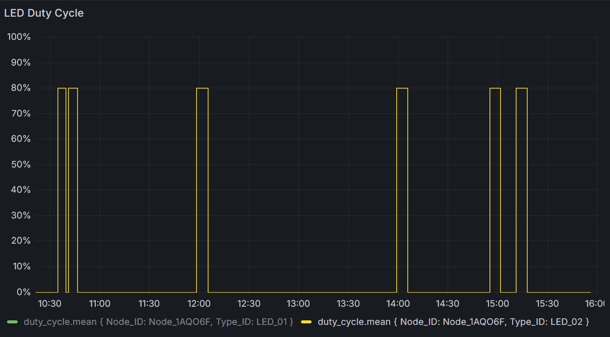
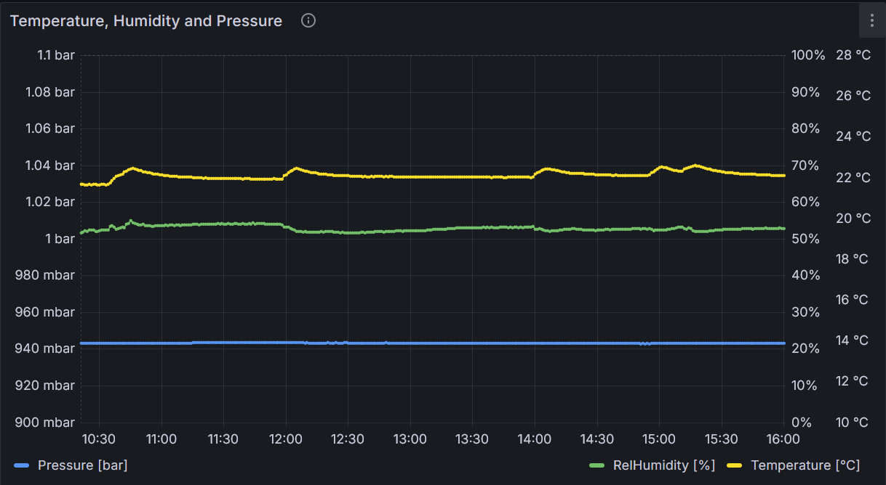

## Elevator Pitch
Going to the bathroom in darkness is inconvenient as turning on the main light blinds you and you are bright awake by the time you're back in bed.

Furthermore, the bathroom is a high-humidity environment where mold can grow if not properly ventilated.

The solution is a motion triggered, illumination varying light and a temperature/humidity sensor to measure current conditions in the bathroom.
Powered by the [Smart-Home Framework](/projects/smart-home-framework/), a node with a motion sensor and temperature & humidity sensor with a LED strip is installed in the bathroom.

## Key Features
- [x] Light follows time-of-day intensity schedule when triggered by motion
- [x] Logs to the cloud; motion detection, temperature and humidity, LED intensity, measured illumination (LDR)

## Future Features
- [ ] Use measured illumination to turn off when obviously main bathroom lights are turned on (spike in illumination)
- [ ] Increase responsiveness (e.g. reduce delay or experiment with radar sensor for human detection)
- [ ] Send notifications 'Open Window' when no window is opened after showering

## Key Skills
- Prototyping with electronics
- PIR motion sensor; C++ integration using interrupts

## Limitations
### Temperature spikes
Turns out that small spikes in temperature are caused by the LED strip itself when turned on.
The spike is minimal, but clearly correlates with the LED duty cycle.
The plots from the Grafana Dashboard visualize this; top shows the LED turning on and off with a duty cycle of 80%; bottom shows temperature (yellow) which clearly spikes slightly whenever the LED strip is turned on.

### Delay
The delay between motion detection and light turning can be up to 2 seconds.
This has two reasons:
1. Passive Infrared Sensors (PIR) is not ideally placed and not the most responsive, it can only detect the heat of feet and not the entire body.
2. The generic firmware developed at the heart of the smart home framework means; when motion is detected, the signal is sent to the cloud for processing. The cloud then commands the node to turn on the light.

In conclusion; experimenting with a radar sensor for human detection may increase responsiveness of the 'human detection' part. However, the delay caused by sending the signal to the cloud and back will remain and is a design choice to future proof a distributed system with centralized control.

## Hardware
- box housing ESP32 is magnetically connected to cabinet
- ESP32 is connected using dupont connectors, i.e. can be removed
- one power supply (24V) passes power through to LED and step-down converter (24V-5V) is used for ESP32
- tool-less removal of black-box should the need arise
