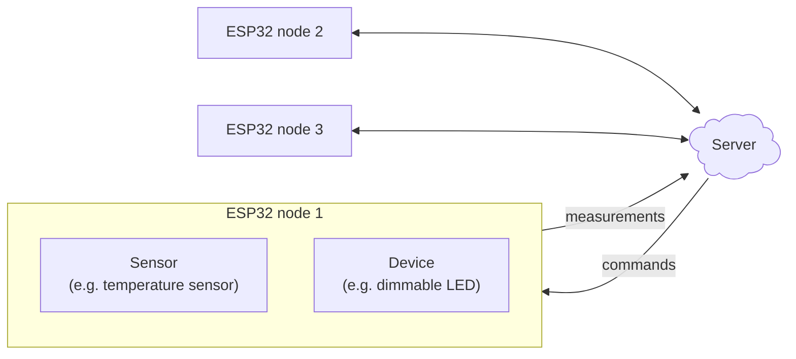

> The key motivation behind this project is to learn about embedded programming and deploying small systems to resolve little-annoyances in day-to-day life.

## Elevator Pitch
Smart-home systems are fun as long as they work reliably and are easy to deploy and maintain.
Off-the-shelf solutions are often expensive, do not come with the features you want, and offer little insight into how your personal data is handled.

This project aims to develop a smart-home framework that is easy to deploy, reliable, and allows for easy customization after deployment without needing to dig-up any deployed microcontrollers.
The framework is a flash-and-forget style firmware for ESP32 microcontrollers, where the smart logic is handled server side.

## Key features
- [x] ESP32 Nodes are reboot and wifi-outage resilient
- [x] Built-in RGB LED indicates connection status/issues
- [x] Server-side logic allows for adaptation, after deployment of nodes
- [x] Nodes can handle any number of sensors and devices concurrently using FreeRTOS

## Future features
- [ ] Sleep/deep sleep for battery powered nodes
- [ ] Query historical data for aggregated decisions
- [ ] Change behavior of nodes remotely (reboot, change sensor publishing frequency, etc.)
- [ ] Add firmware version to node status messages
- [ ] Remove auto-reboot feature when 5 connection attempts to WiFi/MQTT fail. Keep queue of readings in the meantime.

## System
A locally hosted server (Raspberry Pi 5) is the brains of the operation, receiving data from ESP32 and sending commands, all using MQTT.

### Node, Sensors and Devices
ESP32 microcontrollers are so called nodes, which can have any combination of sensors and devices connected.
A `sensor` can only collect data where a `device` can read its current state and receive commands to change its state.
A `sensor` could be a temperature/humidity sensor, a light intensity sensor or a motion sensor.
A `device` could be anything from a light to a motor or servo.

Each sensor or device has its own custom firmware.
Although using inheritance principles, a lot of the features are shared.
One can imagine having a base class, from which only small changes are made for sensors and devices.

### If-When Logic
All 'logic' lives in the server.
The server's job is to receive sensor readings and device states, and send out commands to adjust device states (sensor's cannot receive commands).
This architecture allows fast deployment of nodes, while dealing with the automation logic at a later point.

Node-RED runs on the server and is responsible for triggering real-time responses to incoming messages.
An example may be detecting human prescence in a room and triggering a light to turn on (see project [TODO]()).
> Even if Node A is connected to both the motion sensor and the LED device, the signal 'motion detected' travels to the cloud, gets processed there, and the turn-light-on command sent back to Node A to be executed.

### Reliability
Considerable work has been put into making a node reliable.

Each node as a so called `WiFiManager`, which is a FreeRTOS task that automatically ensures (a) the node is connected to the WiFi whenever possible and (b) the connection to the MQTT broker is successful.

The system uses FreeRTOS tasks to minimize task collisions and computational effort while ensuring parallelization of tasks.
Each sensor/device therefore has it's own priority, which are only overriden by the internal processes (`WiFiManager`) to reconnect to the WiFi or the MQTT broker.
The use of FreeRTOS makes concurrent running of multiple tasks safe and reliable.

### How to setup a new device
To deploy a new ESP32 in a new use-case, one must first ensure proper drivers (inherited customized classes from `sensor` or `device`) exist.
Creating new drivers is straightforward and typically does not take more than a few minutes.

In the main firmware, only few lines need to be added, configuring that sensor XYZ is connected to pin ABC etc.
After successfull flashing, the node will automatically; publish any sensor readings and device states and listen to commands to change device states.
Publishing frequency can be adjusted in the main firmware when adding specific sensors/devices.

The idea is to have each ESP32-Node be somewhat "dumb", knowing only whether it has a sensor or a device connected.

### Chart
The chart outlines the system architecture on a high level, showing how individual ESP32 nodes can communicate with the server for sending of measurements and receiving commands.

